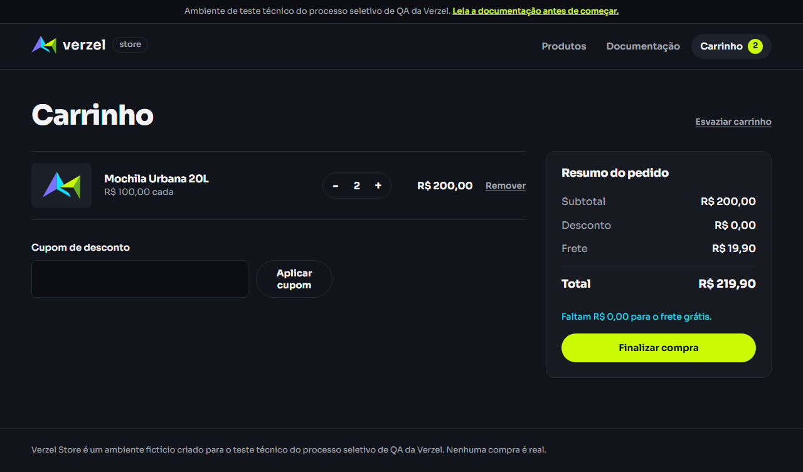
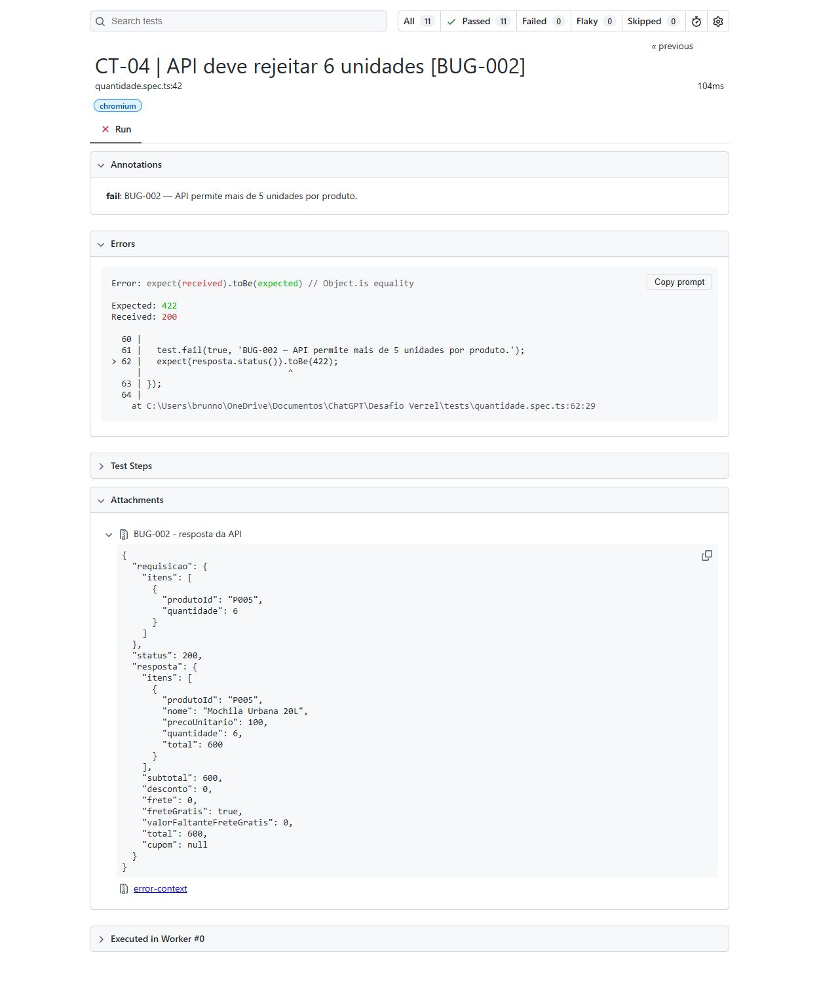
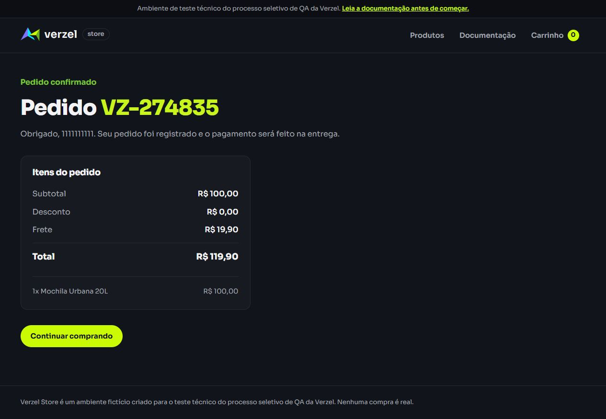

# Verzel Store — desafio de QA Júnior

Suíte pequena de testes da [Verzel Store](https://verzel-store.qa-test-verzel-store.workers.dev/), baseada nos requisitos da entrega VZS-142, versão 2.3.0, e nos comportamentos observados durante a exploração.

O objetivo é verificar **cinco cenários principais** e manter regressões dos dois bugs reproduzidos. Os cinco cenários geram **11 testes independentes**: variantes de dados não representam novos casos funcionais.

## Plano de testes no Google Docs

[Abrir o plano público de testes da Verzel Store](https://docs.google.com/document/d/14eltvQO0OHD4kBVED044ndi_bI8VNPnFFEMGP9FYQYI/edit).

O plano apresenta objetivo e escopo, ambiente e pré-condições, forma de execução, os cinco cenários e seus resultados esperados, critérios de aprovação/reprovação/bloqueio e registro da execução. Inclui os links para casos, evidências e relatório de defeitos. Qualquer pessoa com o link pode visualizar, sem solicitar acesso; a permissão é somente de leitura.

O histórico diferencia a execução bem-sucedida do runner da aprovação funcional: CT-03 e CT-04 permanecem **reprovados** nas variantes afetadas por BUG-001 e BUG-002, mesmo com `test.fail()`. Nenhuma nova execução foi realizada para elaborar o plano.

## Relatório de defeitos no Google Docs

[Abrir o relatório público de defeitos da Verzel Store](https://docs.google.com/document/d/1yNE4UrKaINRwG3k9Hg6c0MbgcrnqlcLTna6scdQBGEo/edit).

O documento reúne **BUG-001 e BUG-002**, confirmados contra regras explícitas, e **BUG-003 — possível defeito de validação do nome**, com comportamento reproduzido e classificação pendente de esclarecimento do requisito. Inclui ambiente e versão, pré-condições, passos, resultado esperado, resultado obtido, impacto e prints incorporados. Qualquer pessoa com o link pode visualizar, sem solicitar acesso; a permissão é somente de leitura.

## Tecnologias

- Playwright e Playwright Test 1.63.0.
- TypeScript 7.0.2.
- Node.js e npm; navegador Chromium instalado pelo Playwright.

## Pré-requisitos

- Node.js 22 ou superior; execução local validada com Node.js 24.
- npm disponível no terminal.
- Acesso à internet para instalar dependências e acessar a loja.

## Instalação

Na pasta do projeto:

```bash
npm ci
npx playwright install chromium
```

O `package-lock.json` mantém as versões das dependências reproduzíveis. Em Linux, se faltarem bibliotecas do navegador, use `npx playwright install --with-deps chromium`.

## Execução

Executar toda a suíte:

```bash
npm test
```

Executar um arquivo específico:

```bash
npm test -- tests/cupom.spec.ts
```

Executar com o navegador visível:

```bash
npm run test:headed
```

Conferir os tipos, sem acessar o sistema:

```bash
npm run typecheck
```

Um único worker executa os testes sequencialmente, sem repetição automática de falhas. Cada teste recebe contexto de navegador ou fixture de API independente. Não são realizados testes de carga, estresse ou segurança.

## Relatório e evidências

Após a execução:

```bash
npm run test:report
```

- `playwright-report/`: relatório HTML com os resultados e anexos.
- `evidencias/resultado-playwright.json`: resultado estruturado da execução mais recente.
- `evidencias/playwright/`: anexos e artefatos gerados pelo runner. Falhas inesperadas preservam screenshot e trace pela configuração padrão da suíte.
- BUG-001 recebe uma captura explícita; BUG-002 recebe a requisição/resposta da API; CT-05 recebe uma captura da confirmação, mesmo quando esses testes têm o resultado previsto.
- [docs/execucao-testes.md](docs/execucao-testes.md): registro da execução validada, com contagem separada das falhas conhecidas.
- `evidencias/automacao/`: cópia preservada da execução de 06/10/2026, com JSON integral, captura de BUG-001, resposta de BUG-002 e confirmação do checkout.
- `evidencias/automacao-pom/`: os mesmos tipos de evidência, preservados na reexecução de 07/10/2026 após a adoção de Page Object Model.

Os relatórios gerados são ignorados pelo Git e podem ser substituídos em novas execuções. A pasta `evidencias/` também contém as evidências preservadas da exploração; elas não são removidas pelo runner, cujo diretório de saída é apenas `evidencias/playwright/`.

Última execução validada, em **07/10/2026 após a refatoração para Page Object Model**: **9 testes aprovados, 2 falhas esperadas (BUG-001 e BUG-002) e nenhuma falha inesperada**, em 25,3 segundos. `npm run typecheck` também passou. O resumo `11 passed` do runner inclui as duas falhas previstas; os detalhes estão no registro de execução.

## Estrutura

```text
pages/
  CatalogoPage.ts
  CarrinhoPage.ts
  CheckoutPage.ts
  ConfirmacaoPage.ts
tests/
  cupom.spec.ts
  frete.spec.ts
  quantidade.spec.ts
  checkout.spec.ts
docs/
  casos-de-teste.md
  bugs.md
  execucao-testes.md
evidencias/
playwright.config.ts
tsconfig.json
package.json
package-lock.json
README.md
```

Os testes usam `test`, `expect`, `async/await`, locators por papel/nome e rótulo, além dos atributos `data-valor` já existentes na interface para identificar os valores do resumo. As asserções de UI usam a espera automática do Playwright; não há `waitForTimeout`, XPath, mocks ou dependência entre testes.

O único `beforeEach` está no arquivo de cupons, pois seus quatro testes começam com a mesma mochila no carrinho. Os testes de API usam diretamente a fixture `request`.

## Page Object Model

As páginas concentram os locators e as ações da interface. Os arquivos `.spec.ts` mantêm os dados, os cenários, os `expect()` e as marcações de bugs conhecidos. Essa divisão facilita a manutenção dos seletores e o reaproveitamento dos fluxos, seguindo a abordagem de [Page Object Model do Playwright](https://playwright.dev/docs/pom).

| Página | Responsabilidade |
| --- | --- |
| `CatalogoPage` | Abrir a loja, adicionar produtos e acessar o carrinho |
| `CarrinhoPage` | Aplicar cupom, expor valores e controles de quantidade e abrir o checkout |
| `CheckoutPage` | Preencher nome, e-mail e CEP e confirmar o pedido |
| `ConfirmacaoPage` | Expor mensagem de sucesso, número do pedido, itens e valores |

Exemplo de uso nos testes:

```typescript
const catalogo = new CatalogoPage(page);
const carrinho = new CarrinhoPage(page);

await catalogo.abrir();
await catalogo.adicionarProduto('Mochila Urbana 20L');
await catalogo.abrirCarrinho();
await carrinho.aplicarCupom('BEMVINDO10');
await expect(carrinho.total).toHaveText('R$ 109,90');
```

Cada objeto recebe a fixture `page` do próprio teste. Não há estado compartilhado entre testes, classe base, herança ou fixtures personalizadas. A suíte mantém os mesmos cinco cenários e 11 testes.

## Cinco cenários automatizados

| Caso | Objetivo | Arquivo | Testes |
| --- | --- | --- | ---: |
| CT-01 | BEMVINDO10 em maiúsculas e em minúsculas com espaços; desconto de 10% sem afetar frete | `cupom.spec.ts` | 2 |
| CT-02 | Mensagens e desconto zero para cupom inválido e expirado | `cupom.spec.ts` | 2 |
| CT-03 | Frete abaixo, no limite e acima de R$ 200,00 | `frete.spec.ts` | 3 |
| CT-04 | Limite de cinco na UI; API com cinco e seis unidades | `quantidade.spec.ts` | 3 |
| CT-05 | Compra fictícia completa, número VZ-XXXXXX e resumo consistente | `checkout.spec.ts` | 1 |

Dados, passos e resultados esperados: [docs/casos-de-teste.md](docs/casos-de-teste.md).

O escopo atual é intencionalmente reduzido. A suíte não reivindica cobertura completa de todos os critérios de aceite ou de todos os experimentos anteriores. O [relatório exploratório original](RELATORIO_EXPLORATORIO_VERZEL.txt) permanece como histórico, não como lista vigente de casos formais.

## Bugs conhecidos

- **BUG-001 — Frete cobrado no limite exato de R$ 200:** a UI cobra R$ 19,90; o teste continua exigindo frete grátis.
- **BUG-002 — API permite mais de cinco unidades por produto:** aceita seis; o teste continua exigindo HTTP 422.

<details>
<summary>Ver print do BUG-001 — cobrança de frete no subtotal de R$ 200,00</summary>



Captura preservada da execução de 06/10/2026, iniciada às 16h53, no horário de Brasília.

</details>

<details>
<summary>Ver print do BUG-002 — API aceita seis unidades</summary>



Captura do relatório de uma execução já existente, iniciada em 06/10/2026 às 18h26, no horário de Brasília. [Requisição e resposta da mesma execução](evidencias/relatorio-defeitos/BUG-002-resposta-api.json). A [origem das evidências](evidencias/relatorio-defeitos/README.md) está registrada junto aos arquivos.

</details>

As duas variantes usam [`test.fail()`](https://playwright.dev/docs/test-annotations), que **executa os testes** e registra a expectativa de falha. Se passarem após uma correção, o runner acusa passagem inesperada. Não usamos `skip`, `fixme` nem assertions ajustadas para aceitar o defeito.

Um processo encerrado com código zero pode incluir falhas esperadas. Por isso, o registro de execução diferencia testes aprovados de defeitos conhecidos reproduzidos. Os detalhes e passos de reprodução estão em [docs/bugs.md](docs/bugs.md).

### Achado exploratório em triagem

**BUG-003 — Checkout aceita nome composto apenas por números:** em 08/10/2026, o nome `1111111111 222222` foi aceito e o pedido `VZ-274835` foi confirmado. Está registrado como **possível defeito**, pois a regra exige nome e sobrenome, mas não detalha os caracteres permitidos. [Registro completo e ressalvas](docs/bugs.md#bug-003--checkout-aceita-nome-composto-apenas-por-números).

<details>
<summary>Ver print do BUG-003 — confirmação com nome numérico</summary>



Captura original da reprodução exploratória de 08/10/2026. O endereço de e-mail não aparece na imagem.

</details>

Esse achado não foi acrescentado à automação: permanecem cinco cenários e 11 testes. O CEP de oito dígitos está de acordo com o formato documentado, e a mensagem de e-mail inválido relatada pelo usuário não se repetiu na reprodução.

## Particularidades do ambiente

O carrinho é isolado por aba, os produtos e cupons são fixos e não há controle de estoque. Pedidos e números são fictícios, sem armazenamento, cobrança ou envio de e-mail. Login, cadastro, pagamento online e consulta de pedidos ficam fora do escopo, conforme a [documentação](https://verzel-store.qa-test-verzel-store.workers.dev/documentacao).

## Uso de IA

IA foi utilizada como apoio para análise da documentação, organização dos cenários, implementação e revisão do código. Os cenários e resultados esperados foram baseados nos requisitos e nos comportamentos observados do sistema. A evidência de execução corresponde aos resultados reais do Playwright, distinguindo falhas conhecidas de falhas inesperadas.
